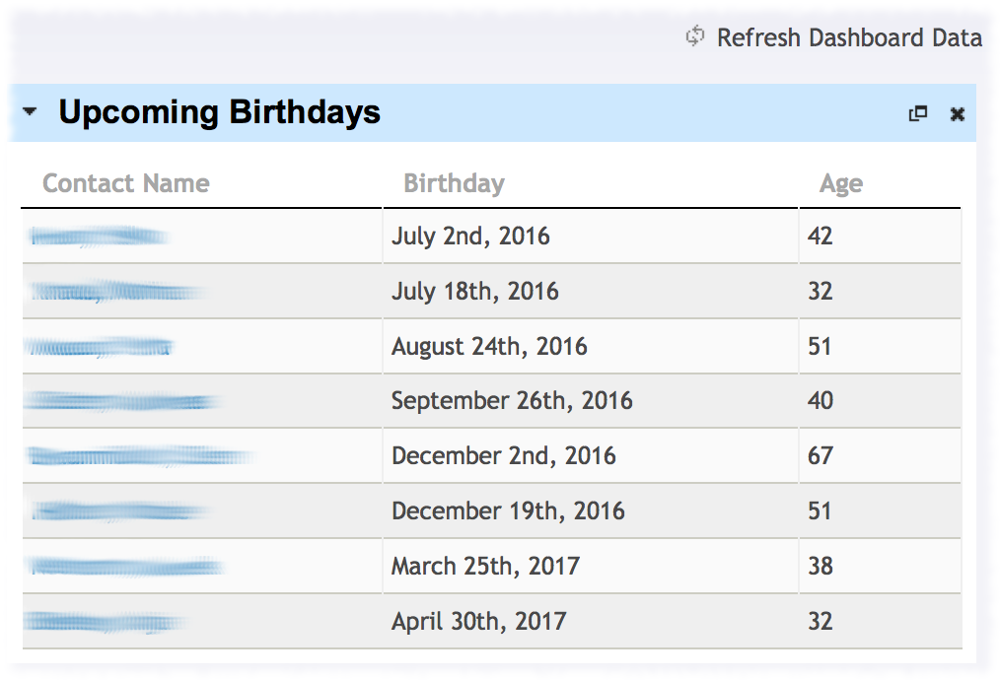
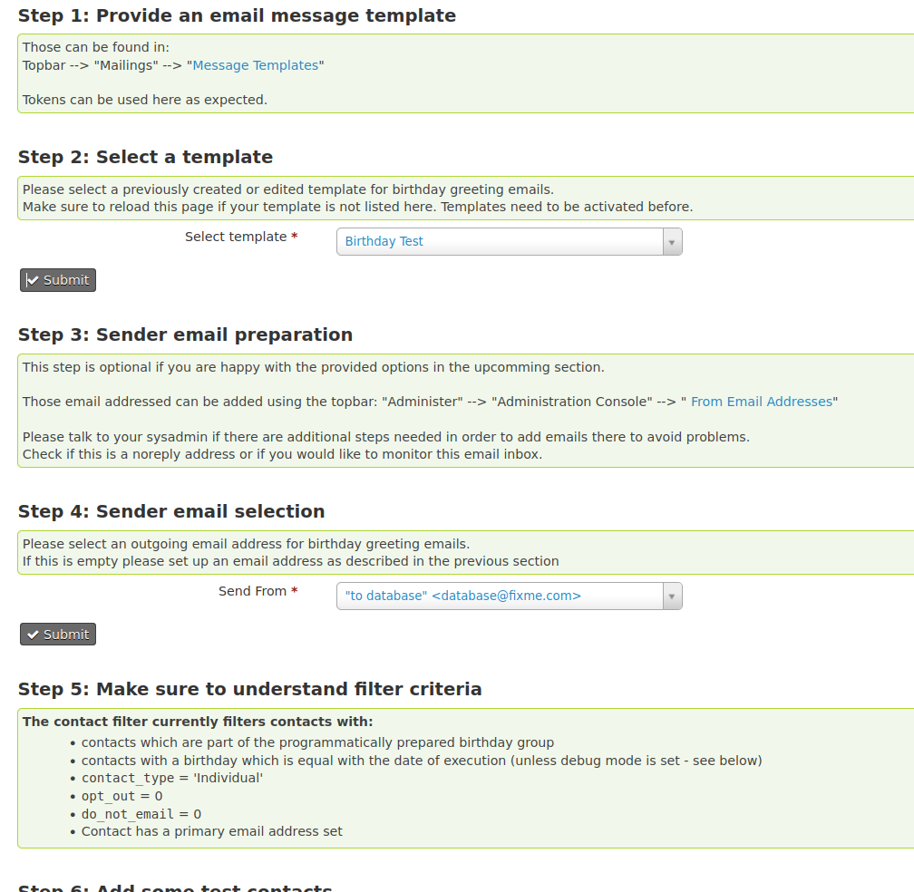
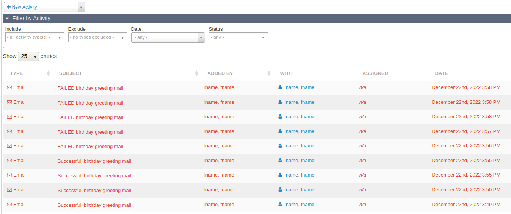

# Birthday Report
Provides a report on upcoming birthdays and an API for sending birthday greetings via e-mail.

## Report
This is a simple CiviCRM report giving you a list of the upcoming birthdays of
your contacts. Simply install the extension, create a new report, and use
"Available for Dashboard" to give you the list upon login.

## Automatical birthday mailings (NEW feature)
With version 1.5 this extension now provides an API for sending birthday greetings automatically via e-mail using 
CiviCRM's scheduled jobs.

Please note: With default settings no email will be sent after upgrading to this verison. Mails only will be
sent if triggering an APIv3 or APIv4 birthday action manually or by using scheduled jobs

### Settings Menu
This page provides infos and settings for configuring the email template and outoing email adress. 
It can be found in 
"adminstration console" --> "Birthdays 
Extension Settings" 

### Activities
An activity is written every for successful / faild email greetings

## Localisation

The extension is currently localised for English and German, but it since the
infrastructure is there, adding another language should be pretty easy. We're
also planning add more features (see
[here](https://github.com/systopia/de.systopia.birthdays/issues)), but currently
lack the funding.
