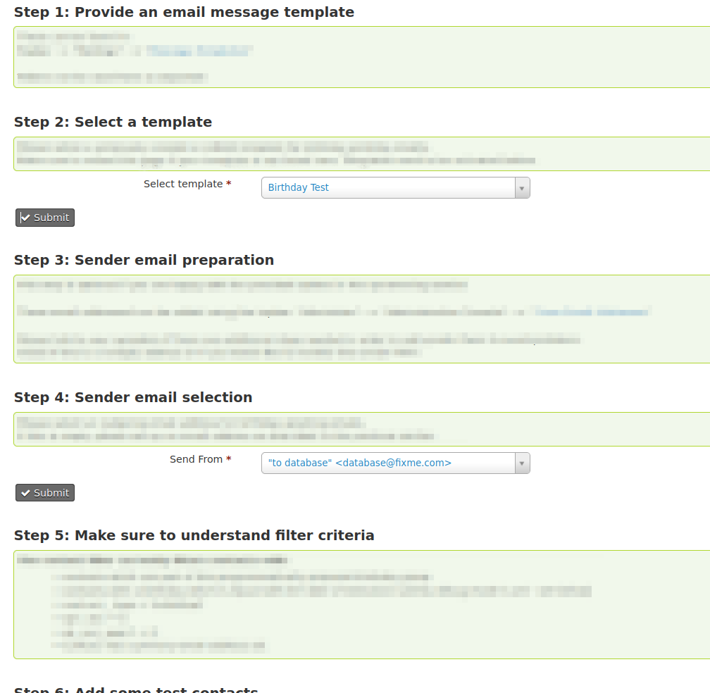
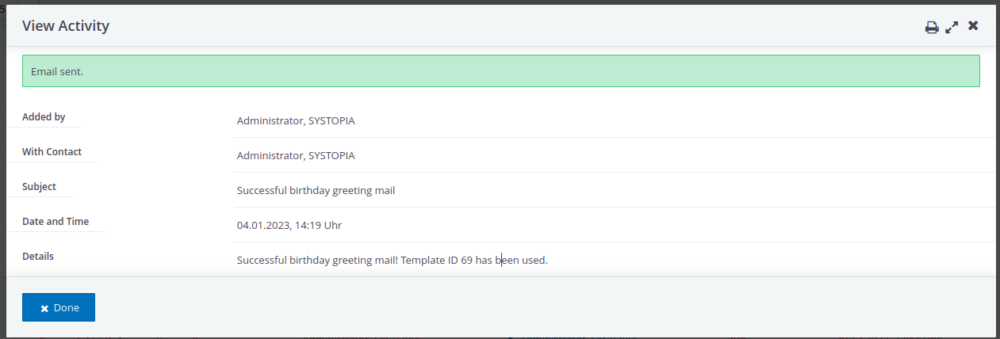

# Automatic birthday mailings (NEW feature)
With version 1.5 this extension now provides an API for sending
birthday greetings automatically via e-mail using CiviCRM's scheduled jobs.

Please note: With default settings no e-mail will be sent after upgrading
to this version. E-Mail only will be sent if triggering an APIv3 or APIv4
birthday action manually or by using scheduled jobs.

## Settings Menu
This page provides a step by step integrated settings guide on how to set up
your Civi for automated birthday email notifications

Navigate to (either or):
- "Administer" --> "Communication" --> "Birthday Settings"  
- "Administer" --> "Administration Console" --> "Birthdays Extension Settings"  

## Received message
This is how a message could look like

## Activities
An activity is written every for successful / failed email greetings

Activity content
